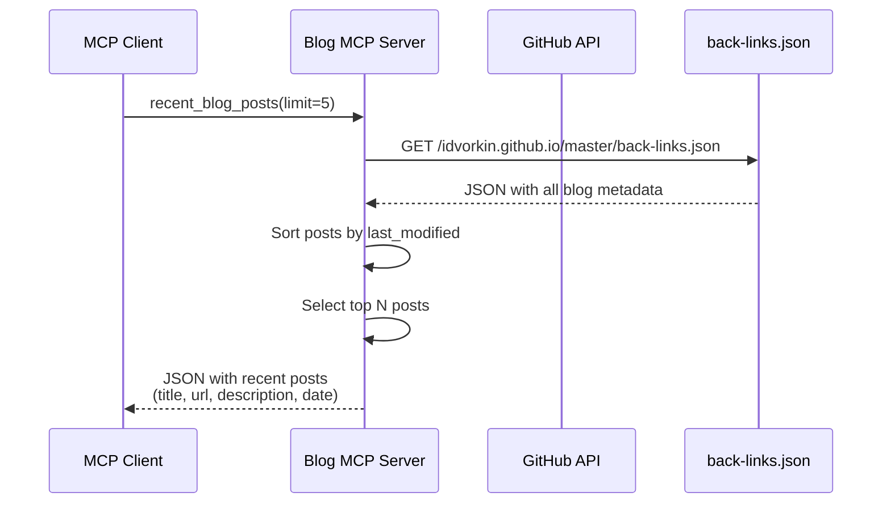
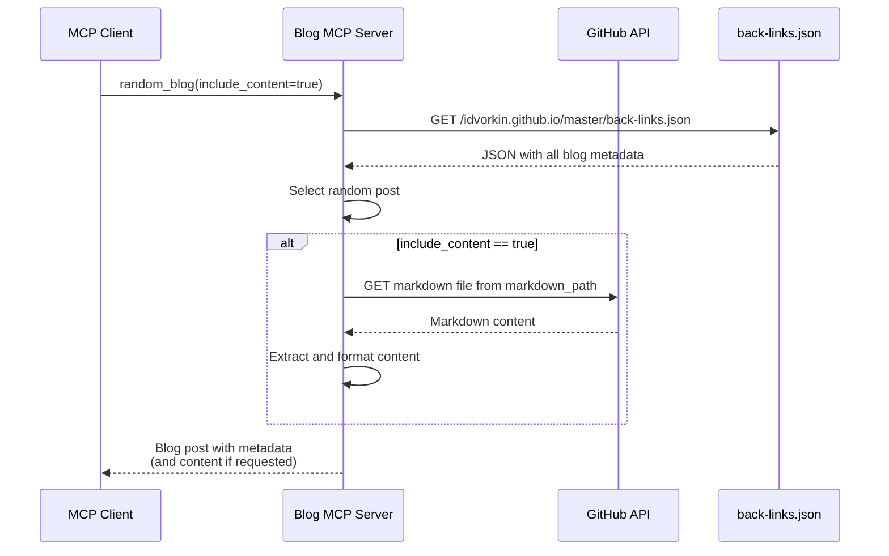
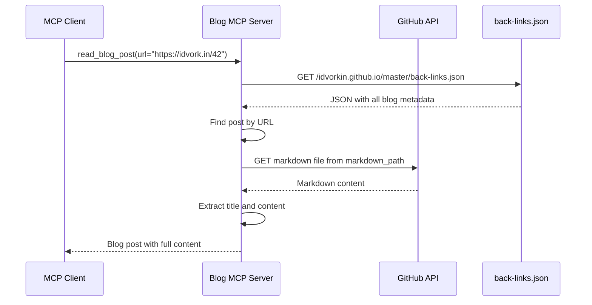

# Blog MCP Server

A FastMCP server that provides tools for interacting with Igor's blog at [idvork.in](https://idvork.in). Built with FastMCP 2.0 for automatic tool registration and protocol handling.

## 🚀 Live Server

**Production URL**: https://idvorkin-blog-mcp.fastmcp.app/mcp

- Automatically deploys on push to main branch
- Requires API key for authentication
- Powered by FastMCP Cloud hosting

## Architecture

- **FastMCP 2.0**: High-level Python framework that handles all MCP protocol details
- **Multi-Repo Support**: Works with multiple GitHub repositories via repo parameters
- **GitHub Source**: Reads markdown files directly from GitHub repositories
- **Simple Tools**: Each tool is just a decorated Python function - no manual protocol implementation
- **Type Safety**: Automatic schema generation from Python type hints
- **Per-Repo Caching**: Each repository has its own cache for optimal performance

### Sequence Diagrams

#### Recent Blog Posts Flow



#### Random Blog Post Flow



#### Read Blog Post Flow



## Features

This MCP server provides 9 tools for repository interaction:

1. **list_repos** - List all available repositories
2. **blog_info** - Get information about a repository
3. **random_blog** - Get a random blog post (with optional content)
4. **read_blog_post** - Read a specific blog post by URL, redirect path, or markdown path
5. **random_blog_url** - Get a random blog post URL
6. **blog_search** - Search blog posts by query (returns JSON)
7. **recent_blog_posts** - Get the most recent blog posts (returns JSON)
8. **all_blog_posts** - Get all blog posts (returns JSON)
9. **get_recent_changes** - Get recent commits from the repository

All tools (except `list_repos`) accept an optional `repo` parameter to specify which repository to use.

## Installation

### Using UV (Recommended)

```bash
just install
```

Or manually:

```bash
uv venv
uv pip install -r requirements.txt
```

## Running the Server

### Local Server (STDIO Transport)

```bash
just serve
```

### HTTP Server for Development

```bash
just serve-http [PORT]  # defaults to port 8000
```

## Configuration

### Environment Variables

The server supports the following environment variables:

| Variable | Description | Default | Example |
|----------|-------------|---------|---------|
| `GITHUB_REPO_OWNER` | GitHub username or organization | `idvorkin` | `myusername` |
| `GITHUB_REPOS` | Comma-separated list of repos or `*` for all | `idvorkin.github.io` | `repo1,repo2,repo3` or `*` |
| `DEFAULT_REPO` | Default repository when not specified | `idvorkin.github.io` | `my-blog` |
| `BLOG_URL` | Base URL for blog (optional) | `https://idvork.in` | `https://myblog.com` |

### MCP Client Configuration

#### Single Repository (Default)

```json
{
  "mcpServers": {
    "blog": {
      "command": "uv",
      "args": ["run", "python", "/path/to/blog_mcp_server.py"],
      "env": {}
    }
  }
}
```

#### Multiple Specific Repositories

```json
{
  "mcpServers": {
    "idvorkin-repos": {
      "command": "uv",
      "args": ["run", "python", "/path/to/blog_mcp_server.py"],
      "env": {
        "GITHUB_REPO_OWNER": "idvorkin",
        "GITHUB_REPOS": "idvorkin.github.io,nlp,techlead",
        "DEFAULT_REPO": "idvorkin.github.io"
      }
    }
  }
}
```

#### All Repositories (Wildcard)

```json
{
  "mcpServers": {
    "idvorkin-all": {
      "command": "uv",
      "args": ["run", "python", "/path/to/blog_mcp_server.py"],
      "env": {
        "GITHUB_REPO_OWNER": "idvorkin",
        "GITHUB_REPOS": "*",
        "DEFAULT_REPO": "idvorkin.github.io"
      }
    }
  }
}
```

## Tools Documentation

### list_repos

List all available repositories that can be accessed.

**Parameters:** None

**Returns:** List of available repositories with the default repo highlighted.

**Example:**
```
Available repositories for idvorkin:
Total: 5 repos
Default repo: idvorkin.github.io

Repositories:
  - idvorkin.github.io
  - nlp
  - techlead
  - notes
  - dotfiles
```

### blog_info

Get information about a repository.

**Parameters:**

- `repo` (string, optional): Repository name (defaults to configured default repo)

**Returns:** Repository information including owner, GitHub URL, and available tools.

### random_blog

Get a random blog post from the repository.

**Parameters:**

- `include_content` (boolean, optional): Whether to include full content (default: true)
- `repo` (string, optional): Repository name (defaults to configured default repo)

**Returns:** Random blog post with title, URL, date, and content (if requested).

### read_blog_post

Read a specific blog post by URL, redirect path, or markdown path.

**Parameters:**

- `url` (string, required): The URL, redirect path (e.g., "42"), or markdown path (e.g., "_d/42.md")
- `repo` (string, optional): Repository name (defaults to configured default repo)

**Returns:** Blog post content with title, URL, date, and full content.

### random_blog_url

Get a random blog post URL.

**Parameters:**

- `repo` (string, optional): Repository name (defaults to configured default repo)

**Returns:** A random blog post URL as plain text.

### blog_search

Search blog posts by title or content.

**Parameters:**

- `query` (string, required): Search query to find relevant posts
- `limit` (integer, optional): Maximum number of results (default: 5, max: 20)
- `repo` (string, optional): Repository name (defaults to configured default repo)

**Returns:** JSON with matching blog posts including titles, URLs, descriptions, and metadata.

### recent_blog_posts

Get the most recent blog posts.

**Parameters:**

- `limit` (integer, optional): Maximum number of posts (default: 20, max: 50)
- `repo` (string, optional): Repository name (defaults to configured default repo)

**Returns:** JSON with recent blog posts sorted by last modified date.

### all_blog_posts

Get all blog posts from the repository.

**Parameters:**

- `repo` (string, optional): Repository name (defaults to configured default repo)

**Returns:** JSON with all blog posts and their metadata.

### get_recent_changes

Get recent commits from the GitHub repository.

**Parameters:**

- `path` (string, optional): File/directory path to filter changes
- `days` (integer, optional): Number of days to look back (mutually exclusive with commits)
- `commits` (integer, optional): Number of recent commits (default: 10, max: 100)
- `include_diff` (boolean, optional): Whether to include diff content (default: false)
- `repo` (string, optional): Repository name (defaults to configured default repo)

**Returns:** Formatted list of recent commits with file changes.

## Development

### Running Tests

```bash
# Run all tests (unit + E2E)
just test

# Fast tests for pre-commit hooks
just fast-test

# Unit tests only
just test-unit

# E2E tests against local server
just test-e2e

# E2E tests against production
just test-prod

# Tests with coverage
just test-coverage
```

### Using MCP CLI Tools

```bash
# Get blog info
just blog_info

# Get random blog post
just random_blog

# Search blog posts
just blog_search "python" 10

# Get recent posts
just recent_blog_posts 5

# Read specific post
just read_blog_post "https://idvork.in/42"

# Call any tool with custom args
just call TOOL_NAME '{"arg1": "value1"}'

# Call tool against production server
just call-prod TOOL_NAME '{"arg1": "value1"}'
```

## Deployment

### Google Cloud Run (Alternative)

```bash
# Deploy from source
just deploy PROJECT_ID [REGION]

# Deploy using container
just deploy-container PROJECT_ID [REGION]

# Check deployment status
just deploy-status PROJECT_ID [REGION]

# View deployment logs
just deploy-logs PROJECT_ID [REGION]
```

## Technical Details

- Built with the Model Context Protocol (MCP) framework
- Uses `httpx` for HTTP requests with proper async support
- Implements content extraction from blog posts using regex patterns
- Supports both stdio and HTTP transport modes
- Includes comprehensive error handling and logging

## Performance Optimization

- **Optimized Implementation**: Uses cached `back-links.json` file
  - Single API call to: https://raw.githubusercontent.com/idvorkin/idvorkin.github.io/master/back-links.json
  - Contains all blog metadata (titles, descriptions, URLs, backlinks)
  - 5-minute cache duration for optimal performance
  - Sub-second response times for most operations

## License

MIT License - see LICENSE file for details.
