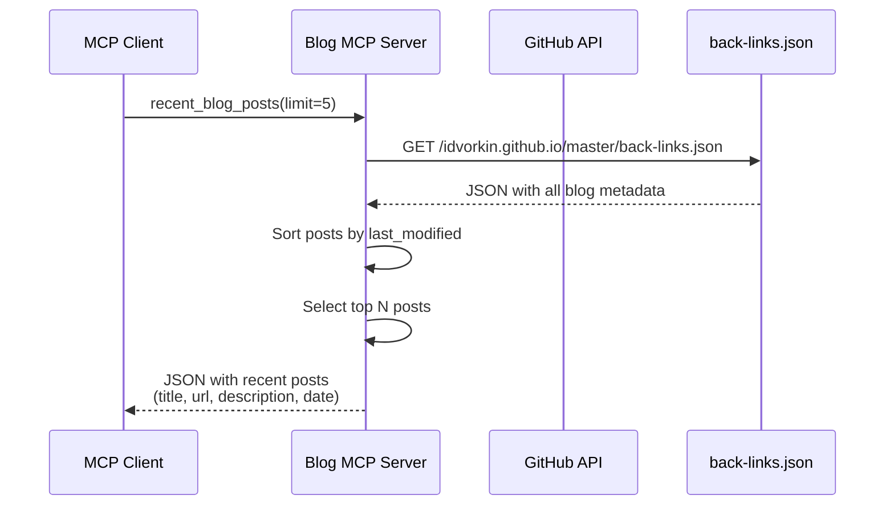
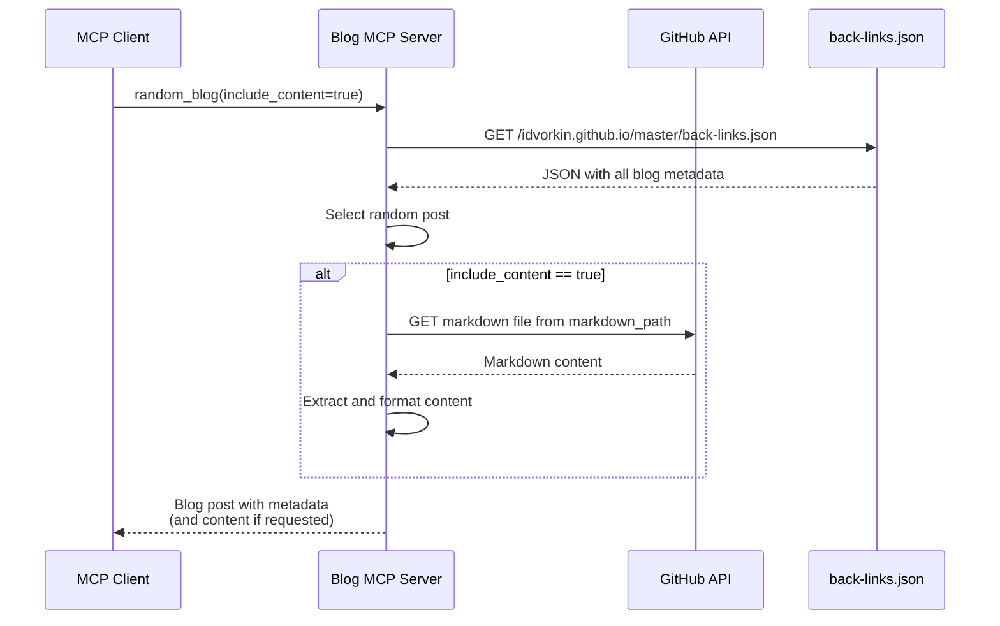
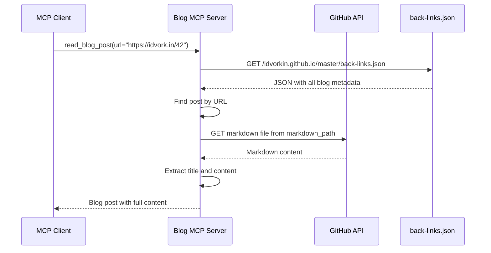

# Blog MCP Server

A FastMCP server that provides tools for interacting with Igor's blog at [idvork.in](https://idvork.in) and any GitHub repository. Built with FastMCP 2.0 for automatic tool registration and protocol handling.

**Multi-Repo Support**: Configure via environment variables to work with any idvorkin repository!

## 🚀 Live Server

**Production URL**: https://idvorkin-blog-mcp.fastmcp.app/mcp

- Automatically deploys on push to main branch
- Requires API key for authentication
- Powered by FastMCP Cloud hosting

## Architecture

- **FastMCP 2.0**: High-level Python framework that handles all MCP protocol details
- **GitHub Source**: Reads markdown files directly from the `idvorkin/idvorkin.github.io` repository
- **Simple Tools**: Each tool is just a decorated Python function - no manual protocol implementation
- **Type Safety**: Automatic schema generation from Python type hints

### Sequence Diagrams

#### Recent Blog Posts Flow



#### Random Blog Post Flow



#### Read Blog Post Flow



## Features

This MCP server provides two tiers of tools:

### Generic Git Tools (work with any repository)

1. **read_file** - Read any file from the repository
2. **get_diff** - Get diff for a specific commit
3. **list_files** - List files and directories
4. **get_recent_changes** - Get recent commits and changes

### Blog-Specific Tools (require back-links.json structure)

1. **blog_info** - Get information about the blog
2. **random_blog** - Get a random blog post (with optional content)
3. **read_blog_post** - Read a specific blog post by URL, redirect path, or markdown path
4. **random_blog_url** - Get a random blog post URL
5. **blog_search** - Search blog posts by query (returns JSON)
6. **recent_blog_posts** - Get the most recent blog posts (returns JSON)
7. **all_blog_posts** - Get all blog posts (returns JSON)

## Installation

### Using UV (Recommended)

```bash
just install
```

Or manually:

```bash
uv venv
uv pip install -r requirements.txt
```

## Running the Server

### Local Server (STDIO Transport)

```bash
just serve
```

### HTTP Server for Development

```bash
just serve-http [PORT]  # defaults to port 8000
```

## Configuration

### Environment Variables

Configure the server to work with different repositories:

```bash
# Default: Igor's blog
GITHUB_REPO_OWNER=idvorkin
GITHUB_REPO_NAME=idvorkin.github.io
BLOG_URL=https://idvork.in
BACKLINKS_PATH=back-links.json

# Example: Different repo
GITHUB_REPO_OWNER=idvorkin
GITHUB_REPO_NAME=nlp
# BLOG_URL and BACKLINKS_PATH optional for non-blog repos
```

### MCP Client Configuration

Add this to your MCP client configuration:

```json
{
  "mcpServers": {
    "blog": {
      "command": "uv",
      "args": ["run", "python", "/path/to/blog_mcp_server.py"],
      "env": {
        "GITHUB_REPO_OWNER": "idvorkin",
        "GITHUB_REPO_NAME": "idvorkin.github.io"
      }
    }
  }
}
```

For other repos, just change the environment variables:

```json
{
  "mcpServers": {
    "nlp-repo": {
      "command": "uv",
      "args": ["run", "python", "/path/to/blog_mcp_server.py"],
      "env": {
        "GITHUB_REPO_OWNER": "idvorkin",
        "GITHUB_REPO_NAME": "nlp"
      }
    }
  }
}
```

## Tools Documentation

### Generic Git Tools

#### read_file

Read any file from the GitHub repository.

**Parameters:**

- `path` (string, required): Path to the file in the repository (e.g., "README.md", "_d/42.md")
- `ref` (string, optional): Git reference (branch, tag, or commit SHA) to read from (default: "master")

**Returns:** File content with metadata header.

**Example:**
```
read_file(path="_d/42.md")
read_file(path="README.md", ref="develop")
```

#### get_diff

Get the diff for a specific commit.

**Parameters:**

- `sha` (string, required): Commit SHA (can be short or full SHA)
- `path` (string, optional): File path to filter diff to specific file
- `full_diff` (boolean, optional): Include full diff content (default: False, shows summary only)

**Returns:** Formatted diff information with commit details and file changes.

**Example:**
```
get_diff(sha="abc123")
get_diff(sha="abc123", path="_d/42.md", full_diff=True)
```

#### list_files

List files and directories in the repository.

**Parameters:**

- `path` (string, optional): Directory path to list (empty string for root, default: "")
- `ref` (string, optional): Git reference to list from (default: "master")

**Returns:** Formatted list of files and directories with sizes.

**Example:**
```
list_files()
list_files(path="_d")
list_files(path="_posts", ref="develop")
```

#### get_recent_changes

Get recent changes/commits from the repository.

**Parameters:**

- `path` (string, optional): File/directory path to filter changes
- `days` (integer, optional): Number of days to look back (mutually exclusive with commits)
- `commits` (integer, optional): Number of recent commits to include (default: 10)
- `include_diff` (boolean, optional): Whether to include diff content (default: False)

**Returns:** Formatted list of recent commits with file changes.

**Example:**
```
get_recent_changes()
get_recent_changes(commits=20)
get_recent_changes(path="_d/", days=7)
```

### Blog-Specific Tools

#### blog_info

Get information about Igor's blog.

**Parameters:** None

**Returns:** Blog information including URL, description, and available tools.

### random_blog

Get a random blog post from the site.

**Parameters:**

- `include_content` (boolean, optional): Whether to include full content (default: true)

**Returns:** Random blog post with title, URL, date, and content (if requested).

### read_blog_post

Read a specific blog post by URL, redirect path, or markdown path.

**Parameters:**

- `url` (string, required): The URL, redirect path (e.g., "42"), or markdown path (e.g., "_d/42.md")

**Returns:** Blog post content with title, URL, date, and full content.

### random_blog_url

Get a random blog post URL.

**Parameters:** None

**Returns:** A random blog post URL as plain text.

### blog_search

Search blog posts by title or content.

**Parameters:**

- `query` (string, required): Search query to find relevant posts
- `limit` (integer, optional): Maximum number of results (default: 5, max: 20)

**Returns:** JSON with matching blog posts including titles, URLs, descriptions, and metadata.

### recent_blog_posts

Get the most recent blog posts.

**Parameters:**

- `limit` (integer, optional): Maximum number of posts (default: 20, max: 100)

**Returns:** JSON with recent blog posts sorted by last modified date.

### all_blog_posts

Get all blog posts from the site.

**Parameters:** None

**Returns:** JSON with all blog posts and their metadata.

## Development

### Running Tests

```bash
# Run all tests (unit + E2E)
just test

# Fast tests for pre-commit hooks
just fast-test

# Unit tests only
just test-unit

# E2E tests against local server
just test-e2e

# E2E tests against production
just test-prod

# Tests with coverage
just test-coverage
```

### Using MCP CLI Tools

```bash
# Get blog info
just blog_info

# Get random blog post
just random_blog

# Search blog posts
just blog_search "python" 10

# Get recent posts
just recent_blog_posts 5

# Read specific post
just read_blog_post "https://idvork.in/42"

# Call any tool with custom args
just call TOOL_NAME '{"arg1": "value1"}'

# Call tool against production server
just call-prod TOOL_NAME '{"arg1": "value1"}'
```

## Deployment

### Google Cloud Run (Alternative)

```bash
# Deploy from source
just deploy PROJECT_ID [REGION]

# Deploy using container
just deploy-container PROJECT_ID [REGION]

# Check deployment status
just deploy-status PROJECT_ID [REGION]

# View deployment logs
just deploy-logs PROJECT_ID [REGION]
```

## Technical Details

- Built with the Model Context Protocol (MCP) framework
- Uses `httpx` for HTTP requests with proper async support
- Implements content extraction from blog posts using regex patterns
- Supports both stdio and HTTP transport modes
- Includes comprehensive error handling and logging

## Performance Optimization

- **Optimized Implementation**: Uses cached `back-links.json` file
  - Single API call to: https://raw.githubusercontent.com/idvorkin/idvorkin.github.io/master/back-links.json
  - Contains all blog metadata (titles, descriptions, URLs, backlinks)
  - 5-minute cache duration for optimal performance
  - Sub-second response times for most operations

## License

MIT License - see LICENSE file for details.
