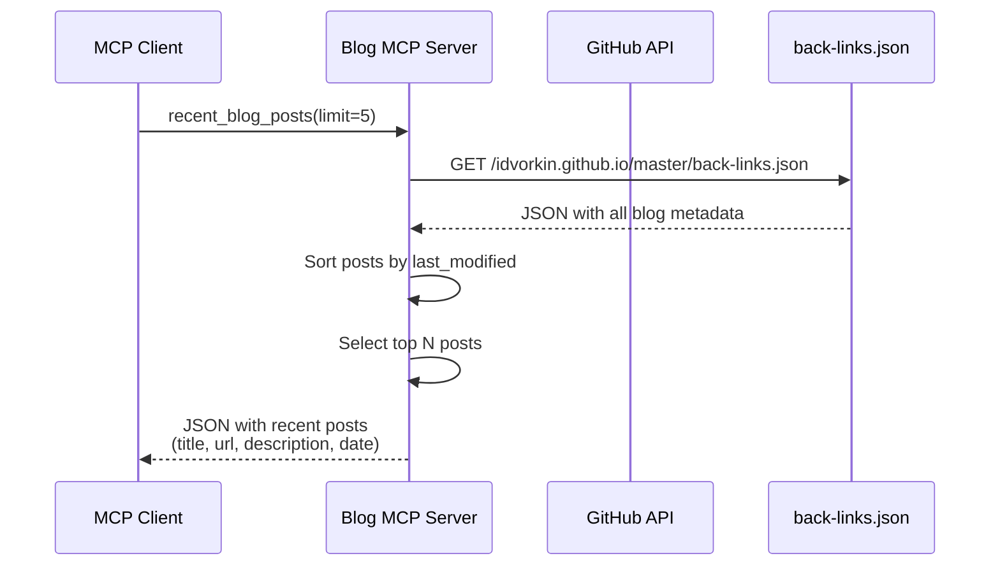
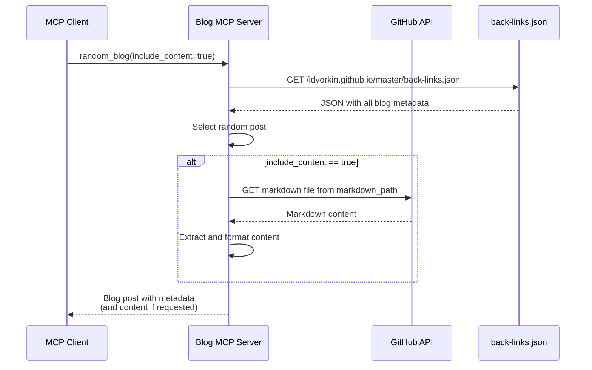
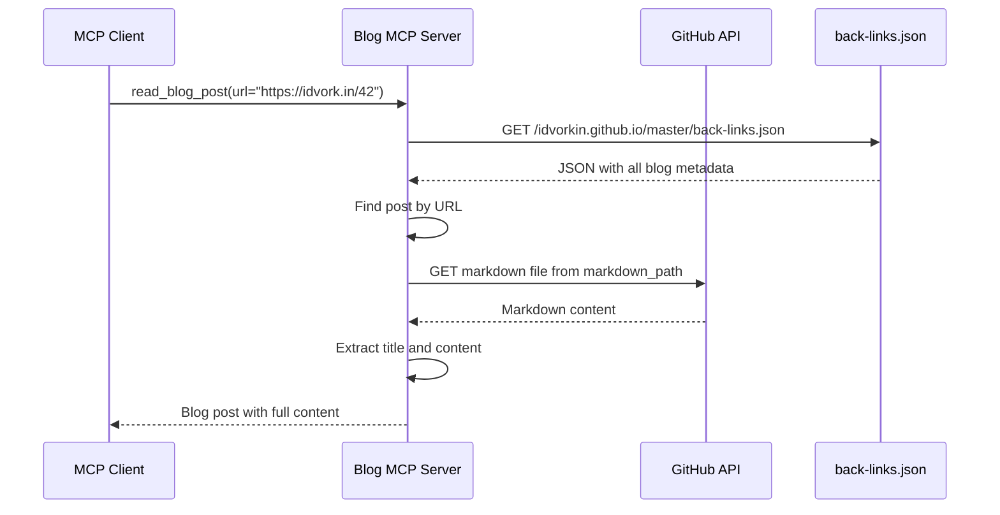

# Blog MCP Server

A FastMCP server that provides tools for interacting with Igor's blog at [idvork.in](https://idvork.in). Built with FastMCP 2.0 for automatic tool registration and protocol handling.

## 🚀 Live Server

**Production URL**: https://idvorkin-blog-mcp.fastmcp.app/mcp

- Automatically deploys on push to main branch
- Requires API key for authentication
- Powered by FastMCP Cloud hosting

## Architecture

- **FastMCP 2.0**: High-level Python framework that handles all MCP protocol details
- **GitHub Source**: Reads markdown files directly from any configured GitHub repository
- **Simple Tools**: Each tool is just a decorated Python function - no manual protocol implementation
- **Type Safety**: Automatic schema generation from Python type hints
- **Multi-Repo Support**: Configure via environment variables to support any repository

### Sequence Diagrams

#### Recent Blog Posts Flow



#### Random Blog Post Flow



#### Read Blog Post Flow



## Features

This MCP server provides 7 tools for blog interaction:

1. **blog_info** - Get information about the blog
2. **random_blog** - Get a random blog post (with optional content)
3. **read_blog_post** - Read a specific blog post by URL, redirect path, or markdown path
4. **random_blog_url** - Get a random blog post URL
5. **blog_search** - Search blog posts by query (returns JSON)
6. **recent_blog_posts** - Get the most recent blog posts (returns JSON)
7. **all_blog_posts** - Get all blog posts (returns JSON)

## Installation

### Using UV (Recommended)

```bash
just install
```

Or manually:

```bash
uv venv
uv pip install -r requirements.txt
```

## Running the Server

### Local Server (STDIO Transport)

```bash
just serve
```

### HTTP Server for Development

```bash
just serve-http [PORT]  # defaults to port 8000
```

## Configuration

### Environment Variables

Configure the server to work with any GitHub repository:

| Variable | Default | Description |
|----------|---------|-------------|
| `GITHUB_REPO_OWNER` | `idvorkin` | GitHub repository owner/organization |
| `GITHUB_REPO_NAME` | `idvorkin.github.io` | GitHub repository name |
| `GITHUB_REPO_BRANCH` | `master` | GitHub repository branch |
| `BLOG_URL` | `https://idvork.in` | Base URL for blog posts |
| `BACKLINKS_PATH` | `back-links.json` | Path to back-links metadata file |

**Example - Using with a different repo:**

```bash
export GITHUB_REPO_OWNER=idvorkin
export GITHUB_REPO_NAME=techlead
export GITHUB_REPO_BRANCH=main
export BLOG_URL=https://example.com
export BACKLINKS_PATH=metadata.json
```

**Note on back-links.json:**
- Some features (search, recent posts) work best with a `back-links.json` metadata file
- If this file doesn't exist, the server gracefully degrades to basic functionality
- See [Back-links Structure](#back-links-structure) below for the expected format

### MCP Client Configuration

Add this to your MCP client configuration:

```json
{
  "mcpServers": {
    "blog": {
      "command": "uv",
      "args": ["run", "python", "/path/to/blog_mcp_server.py"],
      "env": {
        "GITHUB_REPO_OWNER": "idvorkin",
        "GITHUB_REPO_NAME": "idvorkin.github.io",
        "BLOG_URL": "https://idvork.in"
      }
    }
  }
}
```

### Back-links Structure

For optimal performance, repositories should provide a `back-links.json` file with this structure:

```json
{
  "redirects": {
    "/short": "/full-path",
    "/alias": "/actual-path"
  },
  "url_info": {
    "/path": {
      "title": "Post Title",
      "description": "Post description or excerpt",
      "markdown_path": "_d/file.md",
      "file_path": "_site/file.html",
      "last_modified": "2025-01-01T00:00:00Z",
      "doc_size": 5000,
      "incoming_links": ["/other-post"],
      "outgoing_links": ["/referenced-post"]
    }
  }
}
```

**Required fields for full functionality:**
- `title`: Post title
- `markdown_path`: Path to source markdown file
- `last_modified`: ISO timestamp for sorting recent posts

**Optional but recommended:**
- `description`: Used for search results
- `incoming_links`, `outgoing_links`: Enable link analysis

## Tools Documentation

### blog_info

Get information about Igor's blog.

**Parameters:** None

**Returns:** Blog information including URL, description, and available tools.

### random_blog

Get a random blog post from the site.

**Parameters:**

- `include_content` (boolean, optional): Whether to include full content (default: true)

**Returns:** Random blog post with title, URL, date, and content (if requested).

### read_blog_post

Read a specific blog post by URL, redirect path, or markdown path.

**Parameters:**

- `url` (string, required): The URL, redirect path (e.g., "42"), or markdown path (e.g., "_d/42.md")

**Returns:** Blog post content with title, URL, date, and full content.

### random_blog_url

Get a random blog post URL.

**Parameters:** None

**Returns:** A random blog post URL as plain text.

### blog_search

Search blog posts by title or content.

**Parameters:**

- `query` (string, required): Search query to find relevant posts
- `limit` (integer, optional): Maximum number of results (default: 5, max: 20)

**Returns:** JSON with matching blog posts including titles, URLs, descriptions, and metadata.

### recent_blog_posts

Get the most recent blog posts.

**Parameters:**

- `limit` (integer, optional): Maximum number of posts (default: 20, max: 100)

**Returns:** JSON with recent blog posts sorted by last modified date.

### all_blog_posts

Get all blog posts from the site.

**Parameters:** None

**Returns:** JSON with all blog posts and their metadata.

## Development

### Running Tests

```bash
# Run all tests (unit + E2E)
just test

# Fast tests for pre-commit hooks
just fast-test

# Unit tests only
just test-unit

# E2E tests against local server
just test-e2e

# E2E tests against production
just test-prod

# Tests with coverage
just test-coverage
```

### Using MCP CLI Tools

```bash
# Get blog info
just blog_info

# Get random blog post
just random_blog

# Search blog posts
just blog_search "python" 10

# Get recent posts
just recent_blog_posts 5

# Read specific post
just read_blog_post "https://idvork.in/42"

# Call any tool with custom args
just call TOOL_NAME '{"arg1": "value1"}'

# Call tool against production server
just call-prod TOOL_NAME '{"arg1": "value1"}'
```

## Deployment

### FastMCP Cloud (Primary)

The server automatically deploys to FastMCP Cloud when pushed to the main branch.

**Deploying Multiple Instances for Different Repos:**

1. Create separate FastMCP Cloud projects for each repository
2. Configure environment variables in each project:
   ```bash
   GITHUB_REPO_OWNER=idvorkin
   GITHUB_REPO_NAME=techlead
   BLOG_URL=https://techlead.example.com
   ```
3. Deploy each configuration to its own endpoint

**Example: Multiple repo deployments**
- Blog: `https://idvorkin-blog-mcp.fastmcp.app/mcp`
- Notes: `https://idvorkin-notes-mcp.fastmcp.app/mcp`
- Docs: `https://idvorkin-docs-mcp.fastmcp.app/mcp`

### Google Cloud Run (Alternative)

```bash
# Deploy from source
just deploy PROJECT_ID [REGION]

# Deploy using container
just deploy-container PROJECT_ID [REGION]

# Check deployment status
just deploy-status PROJECT_ID [REGION]

# View deployment logs
just deploy-logs PROJECT_ID [REGION]
```

## Technical Details

- Built with the Model Context Protocol (MCP) framework
- Uses `httpx` for HTTP requests with proper async support
- Implements content extraction from blog posts using regex patterns
- Supports both stdio and HTTP transport modes
- Includes comprehensive error handling and logging

## Performance Optimization

- **Optimized Implementation**: Uses cached `back-links.json` file
  - Single API call to: https://raw.githubusercontent.com/idvorkin/idvorkin.github.io/master/back-links.json
  - Contains all blog metadata (titles, descriptions, URLs, backlinks)
  - 5-minute cache duration for optimal performance
  - Sub-second response times for most operations

## License

MIT License - see LICENSE file for details.
